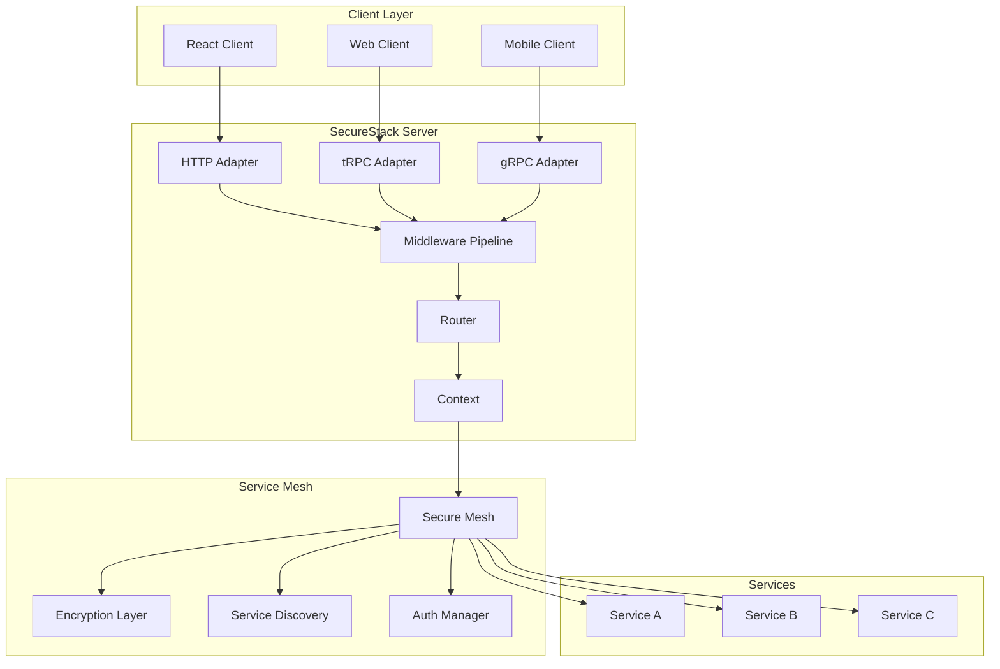
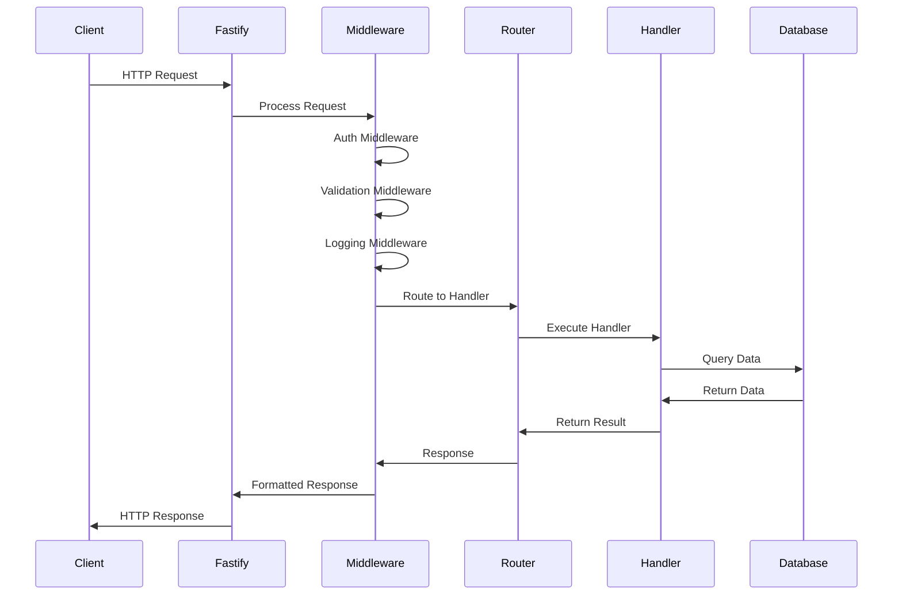
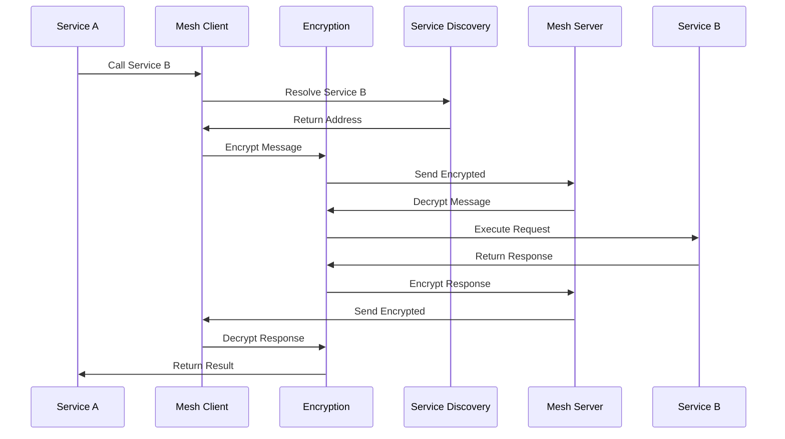
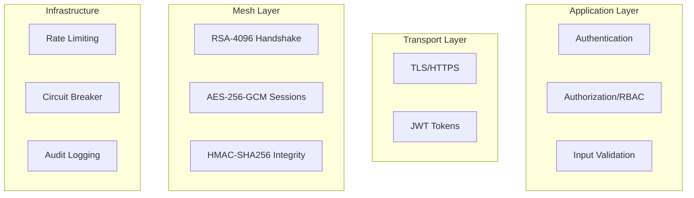

# SecureStack Architecture

This document provides an overview of SecureStack's architecture, design principles, and how different components work together.

## 🏗️ High-Level Architecture



## 📦 Package Architecture

SecureStack is organized as a monorepo with the following packages:

### Core Packages

#### `@lemur-bookstores/core`
The foundation of the framework, providing:
- **Router System**: Type-safe procedure definitions
- **Middleware Pipeline**: Composable middleware chain
- **Context Management**: Request-scoped dependency injection
- **Error Handling**: Standardized error codes and handling
- **Type Inference**: Advanced TypeScript utilities

```typescript
// Core exports
export { SecureStack } from './SecureStack';
export { router } from './router';
export { middleware } from './middleware';
export { createContext } from './context';
export { SecureStackError } from './error';
```

#### `@lemur-bookstores/server`
Server implementation with multiple protocol adapters:
- **Fastify Integration**: High-performance HTTP server
- **tRPC Adapter**: Type-safe client-server communication
- **gRPC Adapter**: Microservices communication
- **Lifecycle Hooks**: Server lifecycle management
- **Health Checks**: Built-in health and metrics endpoints

#### `@lemur-bookstores/client`
Client SDK for consuming SecureStack APIs:
- **Core Client**: Base client implementation
- **React Hooks**: `useQuery`, `useMutation`, `useSubscription`
- **Cache Manager**: Intelligent caching strategies
- **SSR Support**: Server-side rendering utilities

#### `@lemur-bookstores/auth`
Authentication and authorization:
- **JWT Manager**: Token generation and validation
- **RBAC System**: Role-based access control
- **Session Management**: Secure session handling
- **OAuth Providers**: Google, GitHub integration

#### `@lemur-bookstores/mesh`
Service mesh for secure microservices:
- **Hybrid Encryption**: RSA-4096 + AES-256-GCM
- **Mutual Authentication**: JWT-based service auth
- **Service Discovery**: Static and dynamic discovery
- **Circuit Breaker**: Resilience patterns

## 🔄 Request Flow

### HTTP Request Flow



### Microservices Communication Flow



## 🧩 Component Details

### Router System

The router is the core abstraction for defining API endpoints:

```typescript
const userRouter = router()
  .query('getUser', {
    input: z.object({ id: z.string() }),
    handler: async ({ input, ctx }) => {
      return ctx.db.user.findUnique({ where: { id: input.id } });
    },
  })
  .mutation('createUser', {
    input: z.object({ name: z.string(), email: z.string() }),
    handler: async ({ input, ctx }) => {
      return ctx.db.user.create({ data: input });
    },
  })
  .subscription('userUpdates', {
    input: z.object({ userId: z.string() }),
    handler: async function* ({ input }) {
      // Yield updates
      yield { type: 'connected' };
    },
  });
```

**Key Features:**
- Type-safe input/output inference
- Zod schema validation
- Support for queries, mutations, and subscriptions
- Composable and nestable

### Middleware Pipeline

Middleware provides a way to add cross-cutting concerns:

```typescript
const authMiddleware = middleware()
  .use(async ({ ctx, next }) => {
    const token = ctx.req.headers.authorization?.replace('Bearer ', '');
    if (!token) {
      throw new SecureStackError({ code: 'UNAUTHORIZED' });
    }
    const user = await verifyToken(token);
    return next({ ctx: { ...ctx, user } });
  });

const router = router()
  .middleware(authMiddleware)
  .query('protected', {
    handler: async ({ ctx }) => {
      // ctx.user is available here
      return { userId: ctx.user.id };
    },
  });
```

**Execution Order:**
1. Global middleware (applied to all routes)
2. Router-level middleware
3. Procedure-level middleware
4. Handler execution

### Context System

Context provides dependency injection and request-scoped data:

```typescript
// Define context creator
const createContext = () => ({
  db: prisma,
  redis: redisClient,
  logger: winston.createLogger(),
});

// Use in server
const app = new SecureStackServer({
  context: createContext,
});

// Access in handlers
const handler = async ({ ctx }) => {
  // ctx.db, ctx.redis, ctx.logger available
  await ctx.db.user.create({ ... });
};
```

**Context Augmentation:**
Middleware can augment context:

```typescript
const authMiddleware = middleware()
  .use(async ({ ctx, next }) => {
    const user = await authenticate(ctx.req);
    return next({ ctx: { ...ctx, user } });
  });
```

### Error Handling

Standardized error handling across the framework:

```typescript
import { SecureStackError } from '@lemur-bookstores/core';

// Throw errors
throw new SecureStackError({
  code: 'NOT_FOUND',
  message: 'User not found',
  cause: originalError,
});

// Error codes
type ErrorCode =
  | 'BAD_REQUEST'
  | 'UNAUTHORIZED'
  | 'FORBIDDEN'
  | 'NOT_FOUND'
  | 'CONFLICT'
  | 'INTERNAL_SERVER_ERROR';
```

**Error Response Format:**
```json
{
  "error": {
    "code": "NOT_FOUND",
    "message": "User not found",
    "path": "user.getUser"
  }
}
```

## 🔐 Security Architecture

### Multi-Layer Security



### Encryption Flow

1. **Initial Handshake**: RSA-4096 public key exchange
2. **Session Key**: AES-256 session key encrypted with RSA
3. **Message Encryption**: All messages encrypted with AES-256-GCM
4. **Integrity**: HMAC-SHA256 for message integrity
5. **Key Rotation**: Automatic rotation every hour

## 📊 Performance Considerations

### Caching Strategy

```typescript
// Client-side caching
const { data } = useQuery('user.getUser', {
  input: { id: '123' },
  cacheTime: 5 * 60 * 1000, // 5 minutes
  staleTime: 1 * 60 * 1000,  // 1 minute
});

// Server-side caching
const router = router()
  .middleware(cacheMiddleware({ ttl: 300 }))
  .query('expensiveQuery', {
    handler: async () => {
      // Cached for 5 minutes
    },
  });
```

### Connection Pooling

- **Database**: Prisma connection pooling
- **Redis**: ioredis connection pool
- **gRPC**: Channel reuse and connection pooling

### Load Balancing

Service mesh supports multiple load balancing strategies:
- Round-robin
- Least connections
- Random selection

## 🔌 Extension Points

SecureStack is designed to be extensible:

### Custom Middleware

```typescript
export const customMiddleware = middleware()
  .use(async ({ ctx, next }) => {
    // Your logic here
    return next();
  });
```

### Custom Adapters

Implement custom protocol adapters:

```typescript
export class CustomAdapter {
  constructor(private app: SecureStack) {}
  
  async start() {
    // Adapter implementation
  }
}
```

### Custom Cache Strategies

```typescript
export class CustomCacheStrategy implements CacheStrategy {
  shouldCache(key: string): boolean {
    // Custom logic
  }
  
  isStale(entry: CacheEntry): boolean {
    // Custom logic
  }
}
```

## 🚀 Deployment Architecture

### Single Server Deployment

```
┌─────────────────┐
│  Load Balancer  │
└────────┬────────┘
         │
    ┌────▼────┐
    │  Server │
    │  (HTTP) │
    └────┬────┘
         │
    ┌────▼────┐
    │Database │
    └─────────┘
```

### Microservices Deployment

```
┌─────────────────┐
│  API Gateway    │
└────────┬────────┘
         │
    ┌────▼──────────────────┐
    │   Service Mesh        │
    └────┬──────┬──────┬────┘
         │      │      │
    ┌────▼─┐ ┌─▼───┐ ┌▼────┐
    │Svc A │ │Svc B│ │Svc C│
    └──────┘ └─────┘ └─────┘
```

## 📚 Further Reading

- [Router API Documentation](./core/router.md)
- [Middleware Guide](./core/middleware.md)
- [Service Mesh Details](./mesh/overview.md)
- [Deployment Guide](./advanced/deployment.md)
