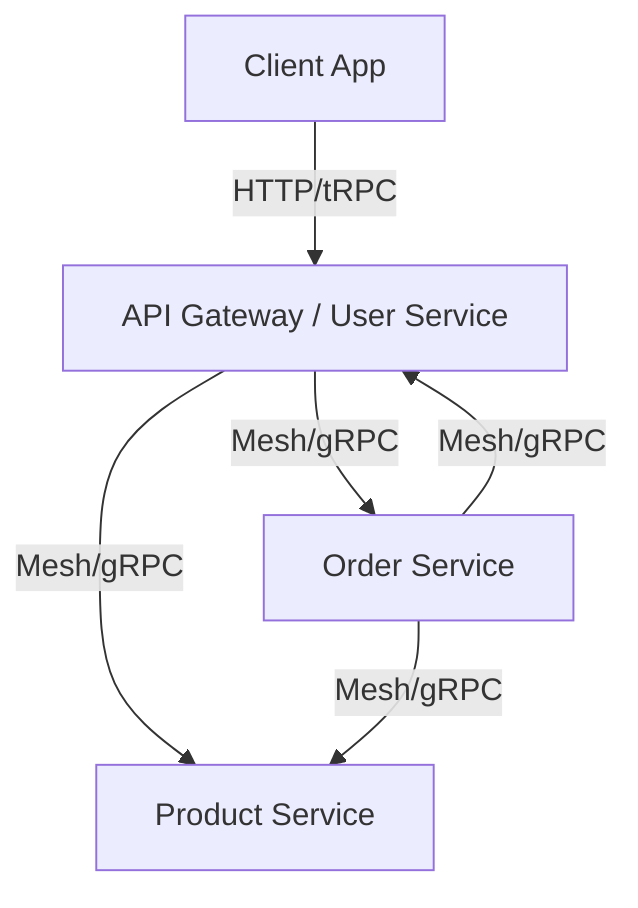

# Microservices Example

This example demonstrates how to build a microservices architecture using SecureStack's Service Mesh. We'll build a simple e-commerce system with three services: `User Service`, `Product Service`, and `Order Service`.

## Architecture



## 1. Shared Configuration

Create a shared configuration package or file to ensure consistency.

```typescript
// shared/config.ts
export const meshConfig = {
  security: {
    encryption: 'hybrid',
    rsaKeySize: 4096,
  },
  discovery: {
    mode: 'static', // For simplicity
    services: [
      { id: 'user-service', host: 'localhost', port: 5001 },
      { id: 'product-service', host: 'localhost', port: 5002 },
      { id: 'order-service', host: 'localhost', port: 5003 },
    ],
  },
};
```

## 2. Product Service

This service manages the product catalog.

```typescript
// services/product/index.ts
import { SecureStackServer, router } from '@lemur-bookstores/secure-stack-server';
import { z } from 'zod';
import { meshConfig } from '../../shared/config';

const app = new SecureStackServer({
  name: 'product-service',
  port: 5002,
  mesh: { ...meshConfig, enabled: true },
});

// Mock database
const products = [
  { id: 'p1', name: 'Laptop', price: 999 },
  { id: 'p2', name: 'Mouse', price: 29 },
];

const productRouter = router()
  .query('get', {
    input: z.object({ id: z.string() }),
    handler: async ({ input }) => {
      return products.find(p => p.id === input.id);
    },
  })
  .query('list', {
    handler: async () => products,
  });

app.router('product', productRouter);
await app.start();
```

## 3. Order Service

This service manages orders and communicates with the Product Service to verify prices.

```typescript
// services/order/index.ts
import { SecureStackServer, router } from '@lemur-bookstores/secure-stack-server';
import { z } from 'zod';
import { meshConfig } from '../../shared/config';

const app = new SecureStackServer({
  name: 'order-service',
  port: 5003,
  mesh: { ...meshConfig, enabled: true },
});

const orders = [];

const orderRouter = router()
  .mutation('create', {
    input: z.object({
      userId: z.string(),
      productId: z.string(),
      quantity: z.number(),
    }),
    handler: async ({ input, ctx }) => {
      // 1. Call Product Service to get price
      const product = await ctx.mesh.call('product-service', 'product.get', {
        id: input.productId,
      });

      if (!product) {
        throw new Error('Product not found');
      }

      // 2. Create order
      const order = {
        id: Math.random().toString(36).substr(2, 9),
        ...input,
        totalPrice: product.price * input.quantity,
        status: 'CREATED',
      };
      
      orders.push(order);
      return order;
    },
  })
  .query('listByUser', {
    input: z.object({ userId: z.string() }),
    handler: async ({ input }) => {
      return orders.filter(o => o.userId === input.userId);
    },
  });

app.router('order', orderRouter);
await app.start();
```

## 4. User Service (Gateway)

This service acts as the entry point for the client.

```typescript
// services/user/index.ts
import { SecureStackServer, router } from '@lemur-bookstores/secure-stack-server';
import { z } from 'zod';
import { meshConfig } from '../../shared/config';

const app = new SecureStackServer({
  name: 'user-service',
  port: 5001,
  mesh: { ...meshConfig, enabled: true },
  cors: { origin: '*' }, // Allow client access
});

const gatewayRouter = router()
  // Proxy to Product Service
  .query('products', {
    handler: async ({ ctx }) => {
      return ctx.mesh.call('product-service', 'product.list', {});
    },
  })
  
  // Proxy to Order Service
  .mutation('createOrder', {
    input: z.object({
      productId: z.string(),
      quantity: z.number(),
    }),
    handler: async ({ input, ctx }) => {
      // Assume user is authenticated and we have their ID
      const userId = 'user-123'; 
      
      return ctx.mesh.call('order-service', 'order.create', {
        ...input,
        userId,
      });
    },
  });

app.router('api', gatewayRouter);
await app.start();
```

## Running the Example

1.  Start all three services in separate terminals.
2.  Make a request to the User Service (Gateway).

```bash
# Get products
curl http://localhost:5001/api/products

# Create order
curl -X POST http://localhost:5001/api/createOrder \
  -H "Content-Type: application/json" \
  -d '{"productId": "p1", "quantity": 2}'
```

## Key Takeaways

- **Decoupling**: Services are independent and can be deployed separately.
- **Type Safety**: Even mesh calls can be type-safe if you share router types.
- **Security**: All inter-service communication is encrypted automatically.
- **Simplicity**: No complex sidecars or infrastructure required for basic mesh functionality.
